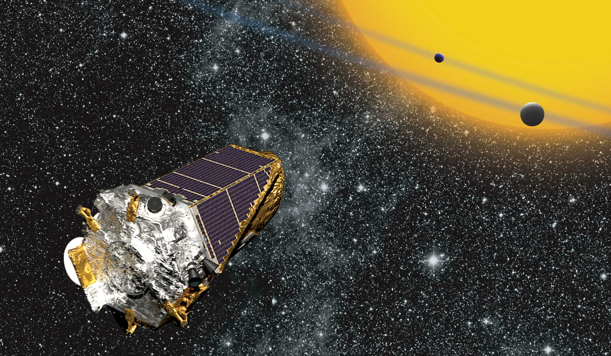

# **Machine Learning with Candidate Exoplanets**

**Overview:**

This document will provide a sense of the general motivation for the project. It will also explain, at a high level, the technologies used and techniques deployed, as well as potential takeaways and areas for further improvement/exploration.

**Motivation:**

In order to be successful in creating machine learning models capable of classifying meaningful data with increasing degrees of accuracy and efficiency, it is important that aspiring data scientists develop effective data preprocessing techniques, model parameter tuning methods, and model comparison insights.

**Interpretation:**

Since, in practice, datasets are often imperfect and contain data unnecessary for the task at hand, the techniques of data preprocessing, model tuning, etc. are an integral part of successful implementation of machine learning solutions. A compelling application of these processes makes use of the data gathered by the NASA Kepler space telescope&#39;s nine-year mission to discover planets outside our solar system.

**Tools and Techniques:**

Logistic Regression, Support Vector Machine, and Deep Learning Models with Python and TensorFlow

Model Validation using the NASA Kepler Exoplanet Dataset

**Potential Takeaways/Implications:**

The ability of an algorithm to accurately identify/classify visual input data, such as that relating to potential exoplanets compiled by NASA&#39;s Kepler telescope, can be achieved through the deployment of various approaches to supervised machine learning such as Logistic Regression models, Support Vector Machines, and Deep Learning.

**Areas for Improvement and/or Future Exploration:**

Understanding the benefits and disadvantages of some of the most effective preprocessing techniques and machine learning models should prove useful in future projects in which accurate classification is the primary objective, but wherefor the data present unique challenges.

**Author(s):**

Daniel S. Toohey

**Acknowledgements/Links:**

Rutgers Data Science Bootcamp (Tom Keel, Charleen Carr, Arindam Mukherjee, Vikas Pandey)

NASA&#39;s Kepler Telescope Data ([https://exoplanetarchive.ipac.caltech.edu/index.html](https://exoplanetarchive.ipac.caltech.edu/index.html))